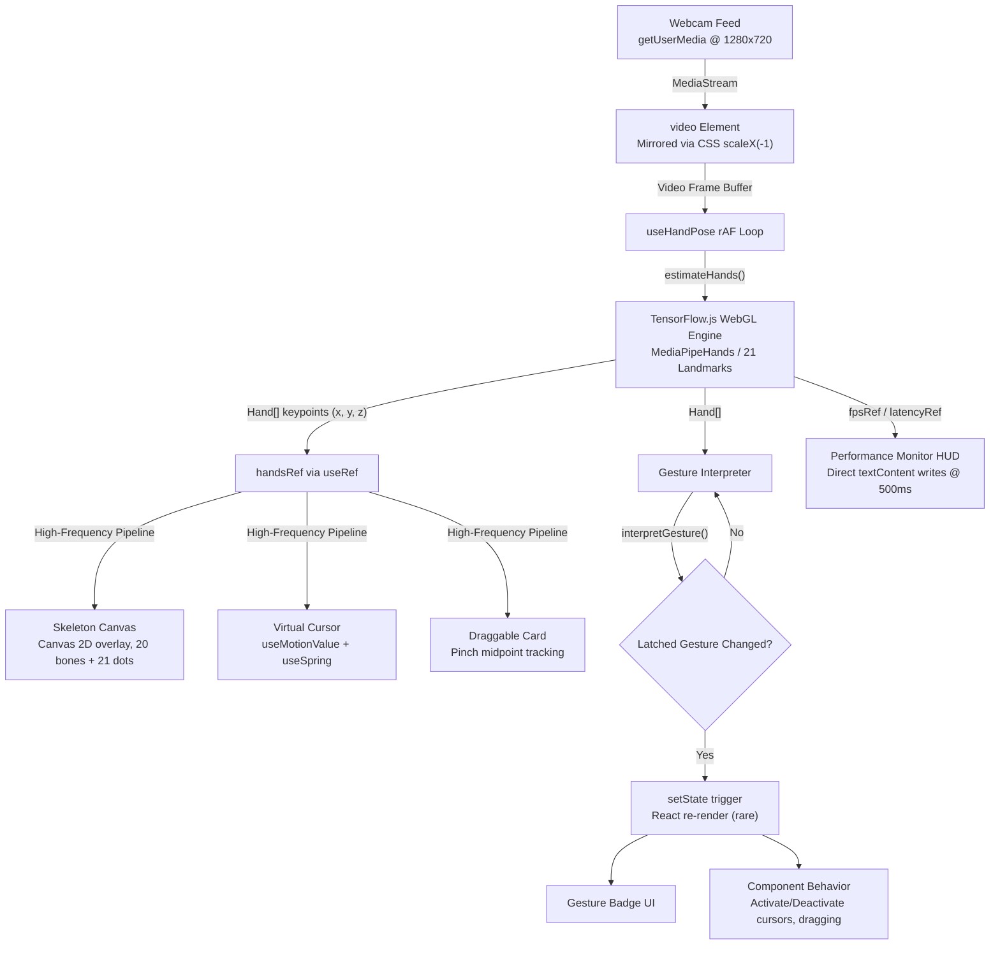

<div align="center">

# Gesture Motion Playground

### A zero-rerender, 60 FPS WebGL hand-gesture interface built with Next.js, TensorFlow.js, and Framer Motion.

[](https://nextjs.org/)
[](https://www.typescriptlang.org/)
[](https://www.tensorflow.org/js)
[](https://tailwindcss.com/)
[](LICENSE)

<br/>
<br/>

> **Application Preview**
>
> 
> 
> 
>

</div>

---

## Key Capabilities

- **60 FPS Machine Vision Pipeline** -- WebGL-accelerated 21 hand-landmark detection with zero memory leaks. The singleton `HandDetector` is loaded once at mount time and disposed cleanly on unmount, ensuring no GPU memory is leaked across hot-reloads or navigation.

- **Zero-Rerender State Architecture** -- High-frequency execution hot-paths are fully decoupled from React reconciliation. Landmark coordinates, cursor positions, and skeleton draw calls flow through `useRef` and `useMotionValue`, resulting in zero `setState` calls inside `requestAnimationFrame` loops.

- **Scale-Invariant Gesture Engine** -- Geometric normalization via `handSpan` (Landmark 0 to Landmark 9 distance) ensures consistent gesture recognition regardless of how close or far the hand is from the camera.

- **High-Speed Virtual Cursor** -- Low-latency spatial tracking bound to Landmark 8 (Index Tip), powered by Framer Motion springs (`damping: 22, stiffness: 280`). The cursor follows finger movement without triggering a single React re-render.

- **Tactile Pinch-to-Drag Interface** -- Physics-driven spatial dragging with proximity thresholds (`HIT_RADIUS: 15%`), midpoint coordinates between Thumb Tip and Index Tip, and spring-based smoothing for a weighted, natural feel.

- **Performance HUD** -- Real-time telemetry monitoring inference FPS (exponential moving average), WebGL latency in milliseconds, active TF.js backend, and current gesture state -- all rendered via direct `textContent` DOM writes at 500ms intervals.

---

## High-Performance Architecture and Engineering Decisions

Achieving a sustained 60 FPS detection loop inside a React application requires deliberate architectural choices that bypass the framework's default rendering model. The following decisions were made to keep the critical path under 16.6 ms per frame.

### Hot Path Bypass

All high-frequency data (landmark coordinates at ~60 Hz) is written to `useRef` containers and Framer Motion `useMotionValue` instances -- never to `useState`. The `useHandPose` hook writes `handsRef.current` on every `estimateHands()` completion; downstream consumers (skeleton canvas, virtual cursor, draggable card) read from that ref inside their own `requestAnimationFrame` loops. React's reconciler is invoked only for discrete state transitions (gesture name changes), which occur at most once every few seconds.

```text
setState (React re-render)    :  Gesture transitions only  (once per few seconds)
useRef / useMotionValue       :  Landmark coordinates       (60 times per second)
Direct DOM textContent write  :  HUD metrics                (2 times per second)
```

### Spatial X-Axis Inversion

The webcam feed is mirrored via CSS `transform: scaleX(-1)` so that the user's movements appear natural. Because this mirror is applied at the CSS layer, the raw `(x, y)` coordinates from TensorFlow.js paint at the correct overlay position (both video and canvas carry the same transform -- double-flip cancels out). However, for UI elements that do **not** carry the CSS mirror (virtual cursor, draggable card), the X coordinate must be explicitly inverted:

```
x' = videoWidth - landmarkX
```

This inversion is applied at the very end of the coordinate pipeline, inside the `requestAnimationFrame` tracking loops of each motion component.

### Native Video Dimension Resolution

TensorFlow.js and MediaPipe calculators can report transformed or inferred dimensions that differ from the actual DOM element size. To avoid misaligned skeleton overlays, the `<video>` element carries explicit `width` and `height` attributes (`1280x720`), and the skeleton canvas re-syncs its `canvas.width` / `canvas.height` to `video.videoWidth` / `video.videoHeight` on every frame. This guarantees 1:1 pixel correspondence between TF.js landmark output and the Canvas 2D drawing context.

### Hysteresis and Frame Latching

Raw TF.js detection output is inherently noisy -- single-frame jitter can cause gesture states to flicker between values. Two complementary filtering strategies are applied:

| Technique | Mechanism | Parameter |
|---|---|---|
| **Hysteresis** | Separate thresholds for start and end transitions. Pinch triggers at `d < 0.20` but only releases at `d > 0.30`. | `PINCH_START_THRESHOLD = 0.20`, `PINCH_END_THRESHOLD = 0.30` |
| **Frame Latching** | A new gesture candidate must be detected for 3 consecutive frames before it replaces the currently latched gesture. | `LATCH_FRAME_COUNT = 3` |

Together, these strategies eliminate visual flicker while introducing less than 50 ms of perceptible latency.

---

## System Architecture and Data Flow

The following diagram illustrates the end-to-end data flow from camera capture to screen rendering. The system is partitioned into two pipelines: a **High-Frequency Pipeline** (zero React re-renders) for continuous spatial data, and a **Discrete Event Pipeline** for gesture state transitions.



### Module Structure

```text
app/
 +-- layout.tsx                 Root layout (Geist fonts, Tailwind globals)
 +-- page.tsx                   Main Playground dashboard (client component)
components/
 +-- webcam-feed.tsx            Video stream handler, gesture poll loop, overlay orchestration
 +-- skeleton-canvas.tsx        Canvas 2D overlay rendering 21 landmarks + 20 bone connections
 +-- playground/
      +-- virtual-cursor.tsx    Neon-glow cursor bound to Landmark 8 via Framer Motion springs
      +-- draggable-card.tsx    Glassmorphism card responding to pinch-to-drag gesture
      +-- performance-monitor.tsx  Cyberpunk HUD displaying FPS, latency, backend, gesture
lib/
 +-- tfjs/
 |    +-- config.ts             TensorFlow.js WebGL backend initialization
 |    +-- detector.ts           Singleton HandDetector loader with lifecycle management
 +-- gestures/
 |    +-- types.ts              Type definitions (GestureName, GestureResult)
 |    +-- math.ts               Euclidean distance, hand span, normalized distance, angle, isFingerExtended
 |    +-- interpreter.ts        Gesture parsing engine with hysteresis and frame latching
 +-- hooks/
      +-- use-webcam.ts         MediaStream acquisition and cleanup hook
      +-- use-hand-pose.ts      requestAnimationFrame detection loop with FPS/latency refs
```

---

## Supported Gestures and Mathematical Logic

All gesture detection operates on 21 hand landmarks produced by the MediaPipe Hands model via TensorFlow.js. Distances are normalized against `handSpan` (the Euclidean distance between Landmark 0 and Landmark 9) to achieve scale invariance.

| Gesture | Identifier | Description | Detection Formula |
|---|---|---|---|
| **Pinch** | `PINCH` | Thumb tip and index tip brought together. Used for click, grab, and drag-and-drop actions. | `D(4, 8) / handSpan < 0.20` (start), `> 0.30` (end via hysteresis) |
| **Point** | `POINT` | Index finger extended while middle, ring, and pinky are curled. Used to drive the virtual cursor. | `d(8, 0) > d(6, 0)` AND `d(t, 0) < d(k, 0)` for t in {12, 16, 20}, k in {10, 14, 18} |
| **Open Palm** | `OPEN_PALM` | All five fingers fully extended. Used for hover state, releasing dragged objects, or neutral reset. | `D(tip, 0) / handSpan > 0.8` for all tips in {4, 8, 12, 16, 20} |
| **Closed Fist** | `FIST` | All four fingers curled toward the palm. Used for pause, clear canvas, or modal trigger. | `D(tip, 0) < D(knuckle, 0)` for all tip/knuckle pairs in {8/5, 12/9, 16/13, 20/17} |
| **Victory** | `VICTORY` | Index and middle fingers extended and spread apart. Used for mode toggle or snapshot trigger. | Index extended AND Middle extended AND Ring curled AND Pinky curled AND `D(8, 12) / handSpan > 0.35` |

> **Detection Priority** (highest to lowest): `PINCH` > `VICTORY` > `POINT` > `FIST` > `OPEN_PALM`. Pinch is evaluated first because it is the most intentional gesture and must take precedence over relaxed hand states.

### Landmark Index Reference (MediaPipe Hands -- 21 Points)

| Index | Landmark | Group |
|---|---|---|
| 0 | Wrist | -- |
| 1-4 | CMC, MCP, IP, Tip | Thumb |
| 5-8 | MCP, PIP, DIP, Tip | Index Finger |
| 9-12 | MCP, PIP, DIP, Tip | Middle Finger |
| 13-16 | MCP, PIP, DIP, Tip | Ring Finger |
| 17-20 | MCP, PIP, DIP, Tip | Pinky |

---

## Tech Stack

| Category | Technology | Purpose |
|---|---|---|
| **Core Framework** | Next.js 16 (App Router), React 19, TypeScript 5 | Server-rendered shell with client-side `'use client'` boundaries for all browser API usage |
| **Computer Vision** | TensorFlow.js 4.22 (`tfjs-core` + `tfjs-backend-webgl`), `@tensorflow-models/hand-pose-detection` | WebGL-accelerated 21-point hand landmark inference via MediaPipeHands model |
| **Physics and Motion** | Framer Motion 13 | Spring-based `useMotionValue` / `useSpring` / `useTransform` for zero-rerender spatial animation |
| **Styling** | Tailwind CSS 4 | Utility-first CSS with dark mode support; glassmorphism and neon glow aesthetics |
| **Icons** | Lucide React | Lightweight SVG icon primitives |

---

## Getting Started

### Prerequisites

| Requirement | Version |
|---|---|
| Node.js | 18.17 or later (LTS recommended) |
| npm, yarn, or pnpm | Any modern package manager |
| Webcam | Required for gesture detection |
| WebGL-capable browser | Chrome 90+, Firefox 90+, Edge 90+, or equivalent |

> **Hardware Note:** A discrete GPU is recommended for sustained 60 FPS inference. Integrated GPUs will work but may exhibit lower frame rates under load.

### Installation

```bash
# 1. Clone the repository
git clone https://github.com/FarrelApriandry/Gesture-Playground.git
cd gesture-playground

# 2. Install dependencies
npm install

# 3. Start the development server
npm run dev
```

Open [http://localhost:3000](http://localhost:3000) in your browser. Grant camera access when prompted. The application will initialize the TensorFlow.js WebGL backend, load the MediaPipe Hands model, and begin real-time gesture detection.

### Available Scripts

| Command | Description |
|---|---|
| `npm run dev` | Start the Next.js development server with hot module replacement |
| `npm run build` | Create an optimized production build |
| `npm run start` | Serve the production build |
| `npm run lint` | Run ESLint across the project |

---

## License

This project is licensed under the **MIT License**. See the [LICENSE](LICENSE) file for details.

---

<div align="center">

**Gesture Motion Playground** -- Engineered for performance, built for interaction.

</div>
