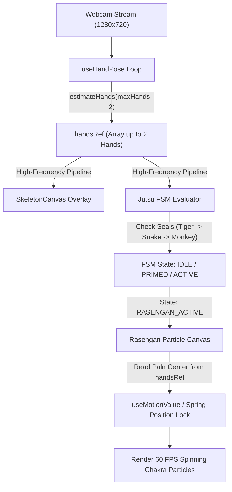

# Naruto Jutsu Engine -- System Architecture & Integration

This document outlines the architectural changes required to integrate multi-hand detection, the dual-hand data pipeline, and zero-rerender particle rendering into Gesture Motion Playground.

---

## 1. Multi-Hand Detector Upgrade

The detector configuration in `lib/tfjs/detector.ts` must be updated from single-hand tracking to dual-hand tracking:

```typescript
// Updated Detector Option
const detectorConfig = {
  runtime: 'tfjs',
  modelType: 'full',
  maxHands: 2, // Upgraded from 1 to support two-handed seals
};

```

This change updates the return value of `estimateHands()` from `[Hand]` to `Hand[]` containing up to 2 detected hand objects per frame.

---

## 2. Dual-Hand Data Pipeline

Continuous hand landmark updates bypass React's render loop entirely to maintain a 60 FPS critical path.



---

## 3. Z-Index Canvas Layering Hierarchy

To maintain visual clarity, all interactive canvas layers over the video feed adhere to the following stack order:

| Layer Name | Component | Z-Index | Pointer Events | Purpose |
| --- | --- | --- | --- | --- |
| Video Feed | `<video>` | `z-0` | `auto` | Mirrored raw camera feed |
| Skeleton Overlay | `<SkeletonCanvas>` | `z-10` | `none` | Green joint nodes and bone connections |
| Rasengan Canvas | `<RasenganCanvas>` | `z-20` | `none` | High-speed spinning chakra particle system |
| Virtual Cursor | `<VirtualCursor>` | `z-30` | `none` | Neon pointer tracking Landmark 8 |
| Performance HUD | `<PerformanceMonitor>` | `z-40` | `none` | Real-time telemetry monitoring |

---

## 4. Zero-Rerender Particle System Strategy

The Rasengan visual effect is implemented in `<RasenganCanvas />` using direct Canvas 2D or WebGL context drawing within its own `requestAnimationFrame` loop:

1. `handsRef.current` is sampled directly every frame.
2. Palm Center coordinates are extracted and inverted across the X-axis:
`x' = videoWidth - palmCenterX`
3. Particle positions, rotational angles, and scale factors are stored in `useRef` containers or Framer Motion `useMotionValue` instances.
4. React `setState` is never invoked during the active Rasengan particle animation.